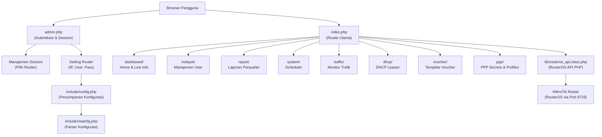
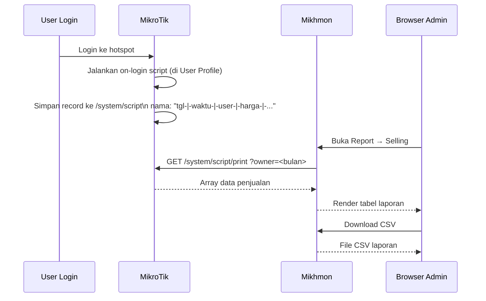

# Analisis Project: MIKHMON V3

> Mikhmon adalah aplikasi web berbasis PHP yang berfungsi sebagai **manajemen hotspot MikroTik** secara terpusat via RouterOS API. Dibangun oleh **Laksamadi Guko** dan dirilis dengan lisensi **GNU GPL v2**.

---

## 1. Ringkasan Proyek

| Atribut | Detail |
|---|---|
| **Nama** | MIKHMON (MikroTik Hotspot Monitor) |
| **Versi** | v3.20 (update terakhir: 30 Juni 2021) |
| **Bahasa** | PHP (server-side), HTML, JavaScript, jQuery |
| **Lisensi** | GNU General Public License v2 |
| **Author** | Laksamadi Guko |
| **Repository** | [laksa19/mikhmonv3](https://github.com/laksa19/mikhmonv3) |
| **Stack** | PHP, Nginx / Apache, RouterOS API |
| **Deployment** | Native PHP atau Docker (docker-compose.yml tersedia) |

---

## 2. Arsitektur Sistem



### Alur Kerja Utama

1. Pengguna login melalui `admin.php?id=login`
2. Setelah login, pilih session (router) di `admin.php?id=sessions`
3. Klik "Connect" → aplikasi terhubung ke router via RouterOS API (port 8728)
4. Semua halaman manajemen diakses melalui `index.php?session=<nama>&hotspot=<fitur>`

---

## 3. Struktur Direktori

```
mikhmonv3/
├── admin.php               # Entry point: login, session, settings router
├── index.php               # Router utama aplikasi (609 baris)
├── docker-compose.yml      # Setup Docker (PHP 7.4 + Nginx + RouterOS emulator)
├── nginx.conf              # Konfigurasi Nginx
├── verson.txt              # Info versi (v3.20)
│
├── include/                # File helper & komponen global
│   ├── config.php          # Penyimpanan data router (flat-file, bukan DB)
│   ├── readcfg.php         # Parser konfigurasi dari config.php
│   ├── menu.php            # Navigasi sidebar & navbar (390 baris)
│   ├── headhtml.php        # HTML head (meta, CSS, JS imports)
│   ├── login.php           # Form login
│   ├── about.php           # Halaman tentang aplikasi
│   ├── lang.php            # Loader bahasa
│   ├── theme.php           # Loader tema
│   └── version.php         # Info versi
│
├── lib/                    # Library inti
│   ├── routeros_api.class.php  # RouterOS API PHP v1.6 (koneksi ke MikroTik)
│   └── formatbytesbites.php    # Helper format bytes
│
├── lang/                   # File bahasa (i18n)
│   ├── id.php              # Bahasa Indonesia
│   ├── en.php              # Bahasa Inggris
│   ├── es.php              # Bahasa Spanyol
│   ├── tl.php              # Bahasa Tagalog (Filipina)
│   ├── tr.php              # Bahasa Turki
│   └── isocodelang.php     # Peta kode ISO bahasa
│
├── css/                    # Stylesheet aplikasi
├── js/                     # JavaScript (jQuery, Highcharts, mikhmon.js)
├── img/                    # Gambar & logo upload
│
├── dashboard/              # Modul Dashboard
│   ├── home.php            # Tampilan utama dashboard
│   └── aload.php           # AJAX loader (sysresource, hotspot, logs)
│
├── hotspot/                # Modul Manajemen Hotspot
│   ├── users.php           # Daftar semua hotspot user
│   ├── adduser.php         # Tambah user
│   ├── userbyname.php      # Edit user berdasarkan nama
│   ├── userbyprofile.php   # Filter user berdasarkan profil
│   ├── userprofile.php     # Daftar profil user
│   ├── adduserprofile.php  # Tambah profil (dengan on-login script)
│   ├── userprofilebyname.php  # Edit profil user
│   ├── generateuser.php    # Generate user massal (voucher)
│   ├── hotspotactive.php   # Daftar pengguna aktif
│   ├── exportusers.php     # Export user ke CSV/Script
│   ├── quickprint.php      # Cetak voucher cepat
│   ├── listquickprint.php  # Daftar quick print
│   ├── quickuser.php       # Tambah user cepat
│   ├── hosts.php           # Daftar hotspot hosts
│   ├── ipbinding.php       # Manajemen IP binding
│   ├── cookies.php         # Manajemen hotspot cookies
│   └── log.php             # Log hotspot
│
├── report/                 # Modul Laporan
│   ├── selling.php         # Laporan penjualan (filter hari/bulan)
│   ├── userlog.php         # Log pengguna
│   ├── livereport.php      # Laporan real-time via AJAX
│   ├── resumereport.php    # Resume laporan bulanan
│   └── print.php           # Cetak laporan
│
├── process/                # Handler aksi (CRUD via RouterOS API)
│   ├── removehotspotuser.php       # Hapus user
│   ├── removehotspotuserbycomment.php # Hapus user by comment
│   ├── removeexpiredhotspotuser.php   # Hapus user expired
│   ├── resethotspotuser.php        # Reset user
│   ├── enablehotspotuser.php       # Aktifkan user
│   ├── disablehotspotuser.php      # Nonaktifkan user
│   ├── removeuserprofile.php       # Hapus profil
│   ├── removeuseractive.php        # Putus koneksi aktif
│   ├── removehost.php             # Hapus host
│   ├── removecookie.php           # Hapus cookie
│   ├── pipbinding.php             # Proses IP binding
│   ├── removereport.php           # Hapus data laporan
│   ├── pscheduler.php             # Proses scheduler
│   ├── reboot.php                 # Reboot router
│   ├── shutdown.php               # Shutdown router
│   └── getvalidprice.php          # Validasi harga
│
├── settings/               # Modul Pengaturan
│   ├── settings.php        # Form edit setting router
│   ├── sessions.php        # Daftar semua router/session
│   ├── settheme.php        # Proses ganti tema
│   ├── setlang.php         # Proses ganti bahasa
│   ├── vouchereditor.php   # Editor template voucher
│   └── uplogo.php          # Upload logo hotspot
│
├── system/                 # Modul System
│   └── scheduler.php       # Manajemen scheduler MikroTik
│
├── traffic/                # Modul Traffic Monitor
│   ├── traffic.php         # API endpoint data trafik (JSON)
│   └── trafficmonitor.php  # Tampilan monitor trafik (Highcharts)
│
├── dhcp/                   # Modul DHCP
│   └── dhcpleases.php      # Daftar DHCP leases
│
├── status/                 # Modul Status
│   ├── index.php           # Status halaman utama
│   ├── status.php          # Info status koneksi
│   └── ping-test.php       # Ping test ke MikroTik
│
└── voucher/                # Modul Template Voucher
    ├── default.php         # Template voucher default
    ├── default-small.php   # Template voucher kecil
    ├── default-thermal.php # Template thermal printer
    ├── template.php        # Template custom
    ├── template-small.php  # Template custom kecil
    ├── template-thermal.php# Template thermal custom
    ├── print.php           # Handler cetak voucher
    ├── printbt.php         # Cetak via Bluetooth
    ├── vpreview.php        # Preview voucher
    └── variable.php        # Variabel template voucher
```

---

## 4. Fitur-Fitur Utama

### 4.1 Dashboard
- **System Info**: Menampilkan tanggal/waktu, nama board, model, versi RouterOS
- **Resource Monitor**: CPU load, free memory, free HDD secara real-time
- **Hotspot Overview**: Jumlah user aktif (Hotspot Active) dan total user terdaftar
- **Traffic Chart**: Grafik Tx/Rx real-time menggunakan Highcharts (update setiap 8 detik)
- **Live Report**: Pendapatan hari ini dan bulan ini (update setiap ~65 detik)
- **Hotspot Log**: Log aktivitas hotspot terkini

### 4.2 Manajemen Hotspot User
| Fitur | Deskripsi |
|---|---|
| User List | Daftar semua hotspot user dengan filter profil & comment |
| Add User | Tambah user manual dengan konfigurasi lengkap |
| Generate User | Generate user massal secara otomatis (bulk voucher) |
| Edit User | Edit detail user termasuk extend/reduce expired date |
| Export User | Export ke CSV atau RouterOS Script |
| Quick Print | Cetak voucher langsung dari daftar user |
| Users by Profile | Tampilan pengelompokan user berdasarkan profil |

### 4.3 User Profile (Paket Hotspot)
- Konfigurasi rate limit (upload/download)
- Expired mode: **None, Remove, Notice, Remove & Record, Notice & Record**
- Validity (masa berlaku) dalam format wdhm (week-day-hour-minute)
- Price (harga jual) dan Selling Price (harga yang tampil di voucher)
- Lock User (hanya bisa digunakan 1 perangkat)
- Address Pool dan Parent Queue
- **Monitor Profile**: Scheduler otomatis untuk cek expired user

### 4.4 Sistem Pencatatan Penjualan (Selling Report)
> Data penjualan disimpan di **MikroTik Router** (bukan database eksternal), menggunakan `/system/script` sebagai penyimpanan.

**Format nama script (data record):**
```
tanggal-|-waktu-|-username-|-harga-|-ip-|-mac-|-validity-|-namaprofile-|-comment
```

**Filter tersedia:**
- Filter per hari (day + month + year)
- Filter per bulan
- Filter berdasarkan prefix username
- Export ke CSV
- Print laporan
- Resume laporan (ringkasan bulanan)

### 4.5 Hotspot Active
- Daftar pengguna yang sedang online
- Filter berdasarkan server hotspot
- Auto-reload berkala
- Aksi: putus koneksi user aktif

### 4.6 Manajemen Lainnya
| Modul | Fitur |
|---|---|
| Hosts | Daftar hotspot hosts |
| IP Binding | Bind IP ke MAC address |
| Cookies | Manajemen hotspot cookies |
| Log | Hotspot log & User log |
| DHCP Leases | Daftar leases DHCP |
| Traffic Monitor | Monitor trafik per interface dengan grafik |
| System Scheduler | Manajemen scheduler MikroTik |
| PPP | Manajemen PPP Secrets, Profiles, Active |

### 4.7 Template Voucher
- Editor template voucher (HTML-based) dengan syntax highlighting
- 3 format: **Default, Small, Thermal**
- Variabel template (PHP): `$username`, `$password`, `$profile`, `$price`, `$validity`, `$qrcode`, dll
- Preview sebelum cetak
- Dukungan cetak Bluetooth (via Quick Printer Android)
- Dukungan cetak thermal printer

---

## 5. Sistem Autentikasi & Keamanan

### Login Admin
- Username & password disimpan di `include/config.php` (flat-file, terenkripsi base64 XOR)
- Session PHP digunakan untuk menjaga status login (`$_SESSION["mikhmon"]`)
- Redirect otomatis ke halaman login jika session tidak ada

### Enkripsi Konfigurasi
```php
// Password router disimpan dengan enkripsi XOR + Base64
function encrypt($string, $key=128) { ... return base64_encode($result); }
function decrypt($string, $key=128) { ... return $result; }
```

### Keamanan Akses File
```php
// Setiap file penting memiliki guard seperti:
if(substr($_SERVER["REQUEST_URI"], -10) == "config.php"){ header("Location:./"); };
```

> [!WARNING]
> Enkripsi yang digunakan (`XOR + Base64`) **bukan kriptografi yang kuat**. Hanya berfungsi sebagai obfuscation. Untuk keamanan production, disarankan tidak mengekspos aplikasi ini ke internet publik tanpa layer keamanan tambahan (VPN, firewall, dll).

---

## 6. Sistem Multi-Session (Multi-Router)

- Satu instalasi Mikhmon dapat mengelola **banyak router MikroTik**
- Setiap router disimpan sebagai entry di `include/config.php`
- Format penyimpanan (flat-file PHP array):
```php
$data['namasession'] = array(
  '1' => 'prefix1!<ip>',
  '2' => 'prefix2@|@<user>',
  '3' => 'prefix3#|#<pass_encrypted>',
  '4' => 'prefix4%<hotspot_name>',
  ...
);
```
- Ganti router dengan dropdown di navbar (tanpa perlu login ulang)

---

## 7. Internasionalisasi (i18n)

Aplikasi mendukung **5 bahasa**:

| Kode | Bahasa |
|---|---|
| `id` | Bahasa Indonesia |
| `en` | Bahasa Inggris |
| `es` | Bahasa Spanyol |
| `tl` | Bahasa Tagalog (Filipina) |
| `tr` | Bahasa Turki |

Bahasa dapat diganti dari **navbar** tanpa reload penuh. File bahasa berisi ~150 string label UI.

---

## 8. Theming

- Tersedia beberapa tema (dark, blue, green, light, dll)
- Tema aktif disimpan di `$_SESSION['theme']`
- Ganti tema langsung dari navbar
- File CSS & JS per tema: `js/mikhmon-ui.<theme>.min.js`

---

## 9. Deploy dengan Docker

```yaml
# docker-compose.yml
services:
  php_7_4:    # PHP 7.4-FPM (172.27.0.5)
  nginx:      # Nginx Alpine, port 8080:80 (172.27.0.6)
  routeros:   # RouterOS emulator, port 8081:80 (172.27.0.7)

networks:
  mikhmon_network: 172.27.0.0/24
```

**Cara jalankan:**
```bash
git clone https://github.com/laksa19/mikhmonv3
cd mikhmonv3
docker-compose up -d
# Akses: http://localhost:8080
# Login Mikhmon: user=mikhmon, pass=1234
# RouterOS Config: http://localhost:8081 → IP 192.168.88.1, pass 12345
```

---

## 10. Teknologi & Library

| Komponen | Teknologi |
|---|---|
| Backend | PHP 7.x |
| Web Server | Nginx (atau Apache) |
| Router API | RouterOS API PHP v1.6 (`routeros_api.class.php`) |
| Frontend Framework | Vanilla HTML + CSS custom |
| JavaScript | jQuery |
| Grafik Trafik | Highcharts (areaspline) |
| Icon | Font Awesome 4.x |
| QR Code | Library lokal (tidak menggunakan Google Chart API sejak v3.13) |
| Penyimpanan Data | Flat-file PHP (`include/config.php`) untuk konfigurasi |
| Penyimpanan Laporan | MikroTik `/system/script` (tanpa database eksternal) |
| Containerization | Docker + docker-compose |

---

## 11. Alur Data Laporan Penjualan



---

## 12. Changelog Singkat (Milestone Penting)

| Versi | Tanggal | Perubahan Penting |
|---|---|---|
| v3.20 | 30-06-2021 | Perbaikan typo script on-login |
| v3.19 | 09-08-2020 | Tampilkan sisa voucher di comment |
| v3.18 | 08-16-2019 | Penambahan selling price (harga tampil di voucher) |
| v3.17 | 08-06-2019 | Live report, generate user, idle timeout, ping IP |
| v3.16 | 07-14-2019 | Address pool di user profile, notif update baru |
| v3.15 | 07-02-2019 | Update RouterOS API untuk support v6.45.x |
| v3.14 | 05-09-2019 | Perbaikan timezone print, penambahan input comment |
| v3.13 | 03-20-2019 | QR Code lokal, perubahan expired mode (tanpa scheduler per user) |
| v3.12 | 03-08-2019 | Perbaikan remove session, tambah print laporan |
| v3.11 | 02-14-2019 | Quick Print (Bluetooth), perbaikan dashboard blank |
| v3.10 | 02-06-2019 | Multi-bahasa, dukungan print Android (Bluetooth thermal) |
| v3.9 | 01-27-2019 | Resume Report, cek koneksi sebelum dashboard |
| v3.8 | 01-22-2019 | Traffic Monitor dengan Highcharts |
| v3.6 | 12-01-2018 | Live Report, progress bar, export CSV/script |
| v3.5 | 11-09-2018 | Chart traffic, filter di Report & User Log |
| v3.4 | 10-30-2018 | Filter server hotspot di Hotspot Active |
| v3.2 | 09-10-2018 | Kolom Time Left, Parent Queue |

---

## 13. Catatan Teknis & Pola Arsitektur

### 13.1 Routing Pattern
`index.php` bertindak sebagai **single-entry-point router** berbasis GET parameter:
```php
// Contoh routing di index.php
if ($hotspot == "users") { include('./hotspot/users.php'); }
elseif ($report == "selling") { include('./report/selling.php'); }
elseif ($sys == "scheduler") { include('./system/scheduler.php'); }
```

### 13.2 API Communication
Semua interaksi dengan MikroTik menggunakan class `RouterosAPI`:
```php
$API = new RouterosAPI();
$API->connect($iphost, $userhost, decrypt($passwdhost));
$getData = $API->comm("/ip/hotspot/user/print");
```

### 13.3 AJAX Auto-Reload di Dashboard
```javascript
// Dashboard auto-reload setiap $areload detik
var dashboard = setInterval(function() {
  $("#r_1").load("./dashboard/aload.php?session=...&load=sysresource");
  $("#r_2").load("./dashboard/aload.php?session=...&load=hotspot");
  $("#r_3").load("./dashboard/aload.php?session=...&load=logs");
}, interval1);

// Live report reload setiap ~65 detik
var livereport = setInterval(function() {
  $("#r_4").load("./report/livereport.php?session=...");
}, 65432);
```

### 13.4 Penyimpanan Konfigurasi (Flat-File)
Tidak ada database sama sekali. Semua konfigurasi router disimpan langsung di `include/config.php` sebagai array PHP. Penghapusan session dilakukan dengan membaca dan menulis ulang file tersebut baris demi baris.

---

## 14. Potensi Pengembangan

Berdasarkan analisis kode dan conversation history sebelumnya, beberapa area yang dapat dikembangkan:

1. **Filter Server di Laporan Penjualan** — Menambahkan field `server` pada script on-login dan dropdown filter di `report/selling.php`
2. **Database Eksternal** — Migrasi dari flat-file ke MySQL/SQLite untuk skalabilitas lebih baik
3. **API REST** — Membuat REST API endpoint untuk integrasi dengan sistem lain
4. **Enkripsi Lebih Kuat** — Mengganti XOR+Base64 dengan AES atau bcrypt untuk password
5. **Update Library** — Highcharts, jQuery, dan Font Awesome sudah cukup lama dan bisa diperbarui
6. **Responsive Mobile** — Penyempurnaan tampilan untuk perangkat mobile
